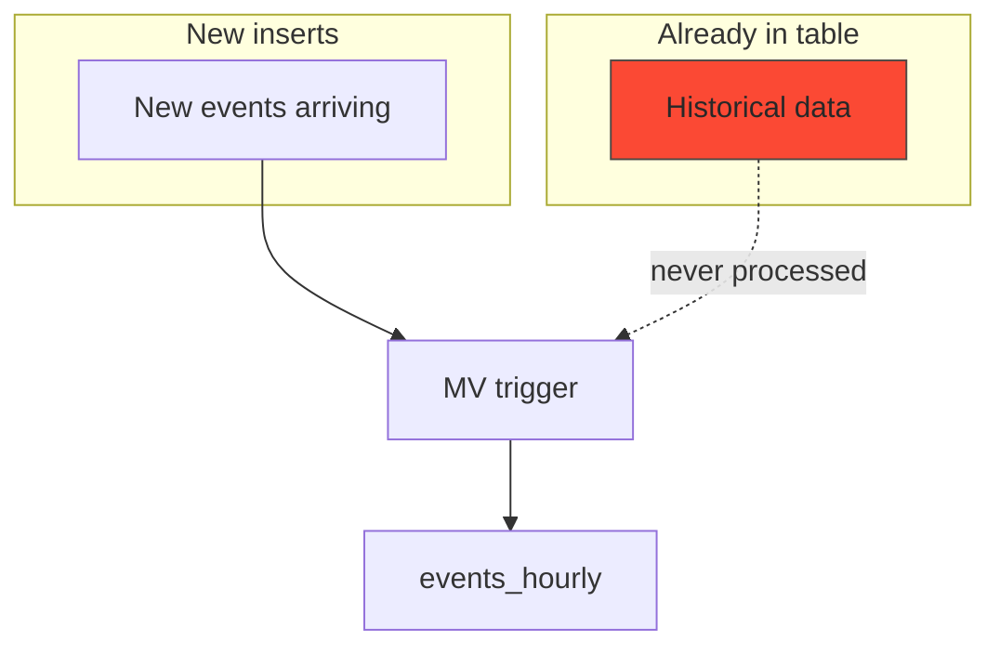

If you've ever changed the logic on a ClickHouse materialized view and needed to reprocess historical data, you've probably hit this problem. The MV only processes new inserts. Old data just sits there. The Null table engine is a clean way to fix that.

## How MVs work in ClickHouse

Materialized views in ClickHouse aren't periodic snapshots like in Postgres. They're triggers. When rows land in the source table, the MV runs its query against that batch and writes the result to a target table.


Great for real-time aggregation. The catch is it only processes new inserts. Anything already in the source table before the MV existed gets ignored.

## The problem

Say you have an MV rolling up events into hourly counts:

```sql
CREATE MATERIALIZED VIEW events_hourly_mv TO events_hourly
AS SELECT
    toStartOfHour(event_time) AS hour,
    event_type,
    count() AS total
FROM events
GROUP BY hour, event_type;
```

New data gets processed. Historical data doesn't.



## What doesn't work

**Manually inserting into the target** means copy-pasting the MV query and hoping it matches exactly. Once you're dealing with `*State` combinators like `quantileState`, any small mismatch means inconsistent data.

**The `POPULATE` keyword** has a race condition. Rows arriving while it runs can get missed. The ClickHouse docs warn against using it in production.

## The Null table trick

ClickHouse has a `Null` table engine. It's `/dev/null` for tables. Anything inserted gets discarded. But materialized views attached to it still fire. The data gets thrown away, but not before the MV processes it.


Create a temporary Null table, attach a copy of your MV pointing at the same target, and replay historical data through it. Raw rows get discarded, aggregated results land where they should.

## Step by step

Create the Null table with just the columns your MV needs:

```sql
CREATE TABLE events_null (
    event_time DateTime,
    event_type String
) ENGINE = Null;
```

Attach a materialized view with the same transformation:

```sql
CREATE MATERIALIZED VIEW backfill_mv TO events_hourly
AS SELECT
    toStartOfHour(event_time) AS hour,
    event_type,
    count() AS total
FROM events_null
GROUP BY hour, event_type;
```

Replay historical data through it in chunks:

```sql
INSERT INTO events_null
SELECT event_time, event_type FROM events
WHERE event_time >= '2025-11-01' AND event_time < '2025-12-01';

INSERT INTO events_null
SELECT event_time, event_type FROM events
WHERE event_time >= '2025-12-01' AND event_time < '2026-01-01';
```

Clean up:

```sql
DROP VIEW backfill_mv;
DROP TABLE events_null;
```

Chunking matters. If you replay everything in one go and it fails halfway, you're starting from scratch. With chunks, you know exactly which range to retry.

## Watch out for duplicates

If your target uses `SummingMergeTree` or `AggregatingMergeTree`, running the same chunk twice will double-count. Drop the affected partition from the target before retrying a failed chunk.

## Why this works well

Same transformation logic for backfill and live data. No copy-pasting queries. Memory stays predictable because it processes block by block. And your production pipeline keeps running the whole time.
