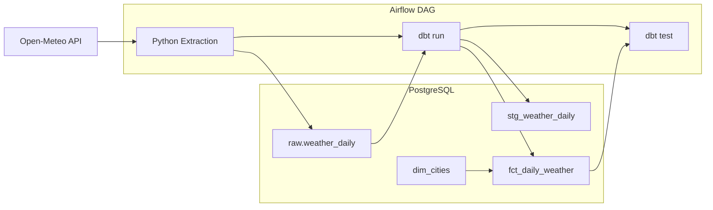

A scheduled ELT pipeline that pulls daily weather data for 10 UK cities from the Open-Meteo API, lands it raw in PostgreSQL, and transforms it into dimensional models using dbt, all orchestrated by Airflow.



## How it works

An Airflow DAG runs daily and does three things in order:

1. A Python extraction script hits the Open-Meteo API and appends the raw JSON response into a `raw.weather_daily` table in PostgreSQL. Each row gets a `loaded_at` timestamp so I can track when data was ingested.

2. dbt picks up the raw data and transforms it through a staging layer (deduplication, type casting) into a mart layer. The final `fct_daily_weather` table joins weather readings with a `dim_cities` seed file and flags extreme weather days (temperature above 30C or precipitation above 50mm).

3. dbt tests run automatically. `not_null` checks on key columns across both layers. If anything fails, the DAG fails too, so I know about it.

The whole thing is idempotent. I can rerun the DAG for any historical date and it won't create duplicates. It deletes and reinserts for that date window. This also means backfilling is straightforward: trigger the DAG 30 times for 30 dates and it just works.

## Prerequisites

Docker and Docker Compose. That's it, everything else runs inside containers.

## Getting started

### 1. Start the stack

```bash
docker compose up --build -d
```

This builds the custom Airflow image (with dbt installed), starts PostgreSQL, runs database migrations, creates the admin user, then brings up the webserver and scheduler. First run takes a couple of minutes for the build.

Check everything is healthy:

```bash
docker compose ps
```

You should see `postgres`, `airflow-webserver`, and `airflow-scheduler` running. `airflow-init` will show as exited (0). That's expected, it's a one-shot setup task.

### 2. Open the Airflow UI

Go to [localhost:8080](http://localhost:8080) and log in with **admin / admin**.

You'll see the `weather_pipeline` DAG. It may take 30 seconds for the scheduler to pick it up after first boot.

### 3. Trigger the DAG

Unpause the DAG using the toggle on the left, then click the play button on the right. The DAG runs three tasks in sequence:

1. **extract_weather** - pulls today's weather data from Open-Meteo for 10 UK cities into `raw.weather_daily`
2. **dbt_run** - seeds the `dim_cities` table and builds the staging + mart models
3. **dbt_test** - runs `not_null` checks across key columns

All three should go green within about 2 minutes.

### 4. Query the data

Connect to the warehouse database:

```bash
docker compose exec postgres psql -U airflow -d warehouse
```

Then explore the three layers:

```sql
-- Raw data as extracted from the API
SELECT * FROM raw.weather_daily ORDER BY city;

-- Deduplicated staging layer
SELECT * FROM public.stg_weather_daily ORDER BY city;

-- Final mart with region and extreme weather flag
SELECT * FROM public.fct_daily_weather ORDER BY city;
```

### 5. Backfill historical dates

```bash
docker compose exec airflow-scheduler airflow dags backfill weather_pipeline -s 2025-06-01 -e 2025-06-07
```

This runs the full pipeline once per date in the range. Each run is idempotent. Safe to re-run without creating duplicates.

### 6. Shut it down

```bash
docker compose down
```

Add `-v` to wipe the database volume and start fresh:

```bash
docker compose down -v
```

## dbt models

- **stg_weather_daily** - deduplicates the raw data by taking the latest `loaded_at` per city and date, casts columns to the right types
- **dim_cities** - a seed file with city name, latitude, longitude, and region
- **fct_daily_weather** - the final fact table joining weather data to city dimensions, with an `is_extreme_weather` flag
