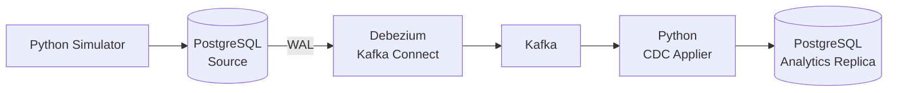
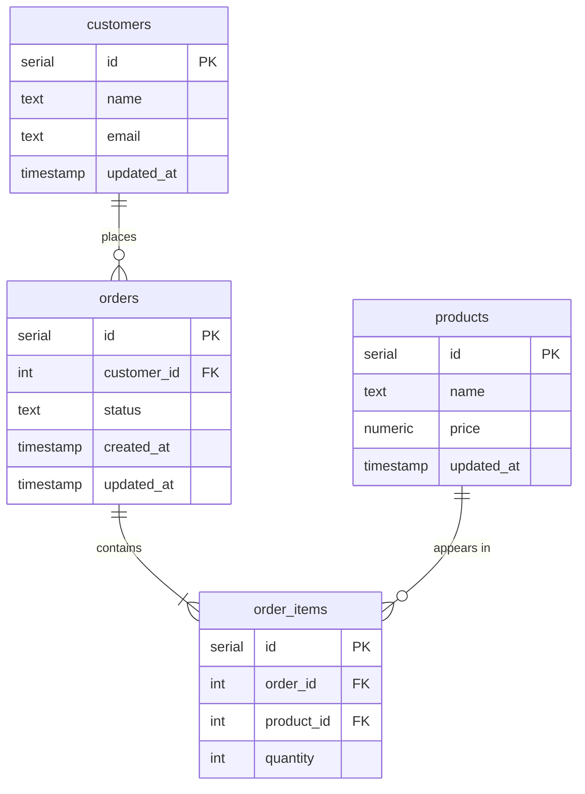

A CDC pipeline that captures row-level changes from a PostgreSQL operational database using Debezium, streams them through Kafka, and applies them to a separate analytics replica in real time.



## How it works

There are two PostgreSQL databases: a source (simulating an operational system) and a target (simulating an analytics replica). The source has a simple order management schema: customers, products, orders, and order items.

A Python simulator script runs in a loop, making changes to the source database every couple of seconds: inserting new customers, creating orders, updating order statuses from `pending` to `shipped` to `delivered`, and occasionally updating a customer's email.

Debezium watches the PostgreSQL write-ahead log (WAL) and captures every insert, update, and delete as a change event. These events flow through Kafka, one topic per table.

A Python consumer reads from the Debezium topics, parses the change event envelope, and applies the corresponding operation to the target database. Inserts become inserts, updates become updates, deletes become deletes. After running for a few minutes, the two databases are in sync.

## Source schema

Four tables that model a basic order system:

- **customers** - id, name, email, updated_at
- **products** - id, name, price, updated_at
- **orders** - id, customer_id, status, created_at, updated_at
- **order_items** - id, order_id, product_id, quantity



## Running it

```bash
docker compose up -d
```

Everything starts automatically: both databases, Kafka, Kafka Connect, Debezium connector registration, the simulator, and the CDC consumer. No manual steps needed.

Verify services are running:

```bash
docker compose ps
```

Check the Debezium connector is registered:

```bash
curl -s localhost:8083/connectors | python3 -m json.tool
```

Watch the simulator creating changes:

```bash
docker compose logs simulator -f
```

Watch the consumer applying CDC events:

```bash
docker compose logs consumer -f
```

Compare row counts between source and target (they should converge within seconds):

```bash
docker compose exec source-db psql -U postgres -d source -c "SELECT 'customers' AS tbl, COUNT(*) FROM customers UNION ALL SELECT 'orders', COUNT(*) FROM orders UNION ALL SELECT 'order_items', COUNT(*) FROM order_items;"

docker compose exec target-db psql -U postgres -d target -c "SELECT 'customers' AS tbl, COUNT(*) FROM customers UNION ALL SELECT 'orders', COUNT(*) FROM orders UNION ALL SELECT 'order_items', COUNT(*) FROM order_items;"
```

There's also a Kafka UI at `localhost:8080` for inspecting the CDC topics and event payloads directly.

If you need to manually re-register the Debezium connector (e.g. after changing its config), you can run `./scripts/register_connector.sh` from the host.

## Design decisions

**CDC vs batch extraction.** Most analytics replicas are populated by periodic full-table dumps. CDC captures individual row changes from the WAL as they happen. Lower latency, less load on the source, and no missed intermediate states.

**WAL-based capture.** Debezium uses PostgreSQL's logical replication slot (`pgoutput` plugin) to read the write-ahead log directly. This means zero changes to application code. Any tool that writes to the source database automatically gets captured.

**No foreign keys on the target.** The analytics replica has the same tables but drops all FK constraints. Debezium publishes events to separate Kafka topics per table, and there's no ordering guarantee across topics. A `customer_id` reference in an order event might arrive before the corresponding customer insert. Removing FKs avoids these race conditions.

**Debezium event envelope.** Each Debezium event contains `before` and `after` snapshots of the row, plus an `op` field (`c` = create, `u` = update, `d` = delete, `r` = snapshot read). The consumer parses this envelope and translates it to the appropriate SQL operation.

**Debezium type encoding.** Debezium's default encoding for PostgreSQL `NUMERIC` is base64 (Java BigDecimal), and for `TIMESTAMP` it's epoch microseconds. The connector config uses `decimal.handling.mode=string` so prices arrive as plain strings, and the consumer converts microsecond timestamps back to Python datetimes.

**At-least-once semantics.** The consumer commits Kafka offsets after applying each poll batch. If it crashes mid-batch, some events will be reprocessed on restart. Inserts use `ON CONFLICT (id) DO NOTHING` to make replays idempotent.

## Why CDC

Most analytics databases are populated by scheduled batch extracts: dump the table every hour, every day, whatever. CDC is the alternative: instead of asking "what does the table look like now?", you capture every individual change as it happens. It's faster, it's less load on the source, and it means your analytics replica is minutes behind production instead of hours.
