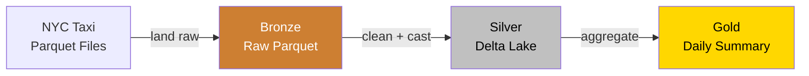

A portfolio project demonstrating the medallion architecture (bronze/silver/gold) on local object storage. Raw NYC taxi Parquet files land in MinIO, get cleaned with Spark (with a full data quality report), and roll up into daily aggregations via Delta Lake merge. All stored as Delta Lake tables with full schema evolution and time travel support.



## Why a lakehouse

In a traditional data warehouse, raw data gets transformed on the way in. If the transformation logic changes or something breaks, you've lost the original. A lakehouse keeps the raw data intact in a bronze layer and builds clean, queryable tables on top. You can always go back to the source.

Delta Lake adds the features that make object storage usable as a real data platform: ACID transactions so writes don't corrupt readers, schema evolution so you can add columns without rewriting history, and time travel so you can query any previous version of a table. It turns a pile of Parquet files into something that behaves like a database.

## How it works

The pipeline processes NYC Yellow Taxi trip data (a well-known public dataset) through three layers, all stored on MinIO object storage.

**Bronze.** Raw Parquet files downloaded from the NYC TLC website, dropped straight into MinIO as-is. Partitioned by year and month. No transformations, just a landing zone.

**Silver.** Spark reads the bronze data and cleans it up: drops trips where the distance or fare is zero or negative, removes records where the pickup time is after the dropoff time, filters out rows with pickup dates outside the expected January-March 2024 range, and casts everything to the correct types. Each filter is applied separately and tracked, producing a data quality report that shows exactly how many rows were dropped and why. Written as a Delta Lake table partitioned by pickup date.

**Gold.** Spark reads the silver table and builds a `daily_summary` aggregation: total trips, average fare, average distance, and total revenue per day. Written using Delta Lake merge (upsert on `pickup_date`) so re-runs update existing rows rather than overwriting the whole table. Also includes hourly trip pattern analysis, weekday vs weekend comparison, and three matplotlib visualizations.

A fourth notebook demonstrates schema evolution (adding a `trip_duration_minutes` column to the silver table) and time travel by querying a previous version of the table with `VERSION AS OF`.

## Design decisions

**MinIO over local filesystem.** The pipeline writes to S3-compatible object storage rather than local disk. This means the same Spark code works against AWS S3, GCS, or Azure Blob with only a config change. MinIO gives you the S3 API locally with a web console to inspect bucket structure.

**Delta Lake over plain Parquet.** Plain Parquet files on object storage give you no transactions, no schema enforcement, and no way to update or delete rows. Delta Lake adds an ACID transaction log on top of Parquet, which means concurrent reads and writes don't corrupt each other, schema changes are tracked, and every version of the table is queryable.

**Partitioning by date.** Bronze is partitioned by `year/month` (matching the source files), silver by `pickup_date`. This lets Spark skip irrelevant partitions when filtering by date range. A query for one week's data reads only seven partitions instead of scanning the entire table.

**Jupyter notebooks over standalone scripts.** For a lakehouse project, notebooks make the data exploration and transformation steps visible. You can see the schema, sample rows, and row counts inline as you move through the pipeline. This is how most data teams actually work with Spark.

**Delta merge over overwrite.** The gold layer uses `DeltaTable.merge()` instead of `mode("overwrite")`. This means re-running the gold notebook updates existing daily rows in place and inserts new ones, rather than dropping and recreating the entire table. In production, this is how you'd handle incremental loads: new data merges in without touching historical rows.

**Explicit data quality tracking over silent drops.** The silver notebook applies each filter separately and counts how many rows each one removes, then prints a quality report with percentages. This makes data loss visible and auditable. In a real pipeline, these numbers would feed into monitoring alerts. A sudden spike in dropped rows signals a problem upstream.

## Schema evolution and time travel

Delta Lake tracks schema changes through its transaction log. When notebook 04 adds a `trip_duration_minutes` column to the silver table, it writes a new version with the updated schema. Old data and new data coexist. Delta Lake fills in nulls for the new column when reading old partitions.

Time travel lets you query any previous version. After the schema change, you can read version 0 (the original table without `trip_duration_minutes`) and version 1 (with the new column) side by side. This is useful for auditing, debugging, and reproducing analyses at a point in time.

## Data quality

The silver notebook produces a quality report showing exactly what was filtered and why:

```
==================================================
DATA QUALITY REPORT
==================================================
Bronze rows:                          9,554,778
--------------------------------------------------
Dropped - distance <= 0:                215,764  (2.26%)
Dropped - fare <= 0:                    127,762  (1.34%)
Dropped - pickup >= dropoff:                344  (0.00%)
Dropped - outside date range:                20  (0.00%)
--------------------------------------------------
Total dropped:                          343,890  (3.60%)
Silver rows:                          9,210,888  (96.40%)
==================================================
```

The numbers above are representative. Actual counts depend on the source data version. The date range filter catches a small number of rows with erroneous pickup dates (e.g. 2002, 2008) that would otherwise leak into the gold aggregations and create misleading daily summaries.

## Running it

```bash
docker compose up -d
```

This starts MinIO (with a web console at `localhost:9001`) and Jupyter at `localhost:8888`. Spark runs in local mode inside the Jupyter container, no separate cluster to manage.

Open Jupyter and run the notebooks in order:

1. `01_ingest_bronze.ipynb` - downloads the taxi data and writes it to MinIO
2. `02_transform_silver.ipynb` - cleans the data with a quality report and writes the silver Delta table
3. `03_aggregate_gold.ipynb` - builds the daily summary with merge, adds hourly and weekday analysis, renders charts
4. `04_schema_evolution.ipynb` - adds a column and demonstrates time travel

You can browse the bucket structure in the MinIO console (`admin` / `admin123456`) to see how the data is physically laid out.

## Bucket layout

```
lakehouse/
├── bronze/taxi_trips/year=2024/month=01/  - raw Parquet
├── bronze/taxi_trips/year=2024/month=02/
├── bronze/taxi_trips/year=2024/month=03/
├── silver/taxi_trips/pickup_date=2024-01-01/  - Delta Lake
├── silver/taxi_trips/_delta_log/
├── gold/daily_summary/  - Delta Lake
└── gold/daily_summary/_delta_log/
```

Deliberately kept to one dataset and three layers. The goal is the architecture, not the breadth of data.
