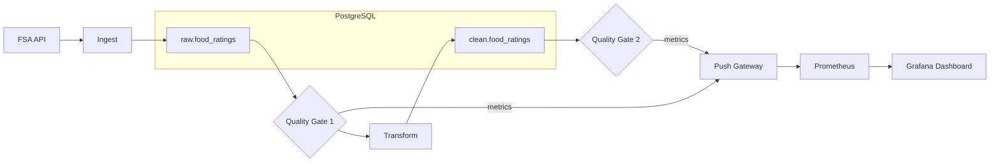

A data pipeline that ingests UK food hygiene ratings from the Food Standards Agency API (a genuinely messy public dataset), validates it at each stage with automated quality checks using Great Expectations, and exposes pipeline health metrics through Prometheus and Grafana.



## How it works

The UK Food Standards Agency publishes inspection data for every food establishment in the country. It's messy in all the ways real data is messy: mixed rating schemes (numeric 0-5 alongside text-based "Pass"/"Improvement Required"), missing postcodes, duplicate entries, and inconsistent formats across local authorities. That's what makes it a good fit for this project.

The pipeline pulls data for four London boroughs (~9,000 establishments) and has two stages with a quality gate after each:

**Ingest.** Hit the FSA API, load the raw JSON responses into a `raw.food_ratings` table in PostgreSQL. Then run the first quality gate using Great Expectations: check that the table isn't empty, that `business_name` is never null, that `rating_value` is in the expected set (0-5, "Exempt", "AwaitingInspection"), and that `rating_date` is never null. Pass/fail results get pushed to Prometheus via the push gateway.

**Transform.** Clean the data into `clean.food_ratings`: drop rows with null business names, keep only numeric ratings (0-5) and drop text-based ones ("Pass", "Exempt", etc.), parse dates into a consistent format, and deduplicate by business name and postcode (keeping the latest inspection). Then run the second quality gate: check that `business_name` and `rating_value` are never null, that rating values are between 0 and 5, and that the row count is within 20-100% of the raw count (the threshold is low because the data legitimately contains many text-based ratings that get filtered out).

Every pipeline run pushes metrics to Prometheus via a push gateway: rows ingested, rows after cleaning, number of quality checks passed and failed, and duration of each stage. Grafana picks all of this up and displays it across four dashboard panels: stage durations, quality check pass/fail rates, row counts by stage, and quality trends over multiple runs.

## Design decisions

**Great Expectations over hand-rolled checks.** You could write `assert len(df) > 0` and call it a quality check. GX adds structure: each expectation is declarative, results are machine-readable, and the framework handles partial failures (some checks pass, some fail, you get a detailed report either way). It's also what teams actually use in production.

**Prometheus push gateway over direct scraping.** The pipeline is a batch job that runs and exits. There's no long-lived process for Prometheus to scrape. The push gateway acts as a buffer: the pipeline pushes metrics when it runs, and Prometheus scrapes the gateway on its regular interval. This is the standard pattern for batch workloads.

**Quality gate after each stage, not just at the end.** Gate 1 validates the raw data before any transformation happens. This catches upstream issues (API returning bad data, schema changes) before you waste compute cleaning something that's fundamentally broken. Gate 2 validates the output of the cleaning logic itself.

**Cleaning report with per-filter counts.** The transform step applies each filter separately and tracks how many rows each one removes. This makes data loss visible. In a real pipeline, a sudden spike in "dropped rows with non-numeric rating" signals a problem upstream.

**Real data over synthetic data.** The FSA dataset has genuine quality issues: London boroughs mix FHRS (numeric 0-5) and FHIS ("Pass"/"Improvement Required") rating schemes in the same API response. Quality Gate 1 catches this: the `rating_value` check fails because values like "Pass" and "Improvement Required" aren't in the expected set. The transform then handles it by keeping only numeric ratings. This is a real data quality problem, not a contrived one.

## Data quality

The cleaning report from a typical run:

```
==================================================
CLEANING REPORT
==================================================
Raw rows:                  8919
--------------------------------------------------
Null business name:           0  (0.00%)
Invalid rating:            5291  (59.32%)
Bad date:                     0  (0.00%)
Duplicates:                   7  (0.08%)
--------------------------------------------------
Total dropped:             5298  (59.40%)
Clean rows:                3621  (40.60%)
==================================================
```

The large drop rate is expected. The FSA data for these London boroughs includes many establishments using text-based rating schemes ("Pass", "Exempt", "Awaiting Inspection") rather than the numeric 0-5 scale. The pipeline deliberately filters these out since the clean table normalises ratings to integers.

## Running it

```bash
docker compose up -d --build
```

This starts PostgreSQL, Prometheus, the Prometheus push gateway, and Grafana (with a pre-provisioned dashboard at `localhost:3000`).

Run the pipeline:

```bash
docker compose run --rm pipeline python run_pipeline.py
```

You can also run the stages individually:

```bash
docker compose run --rm pipeline python ingest.py
docker compose run --rm pipeline python transform.py
```

Open `localhost:3000` for the Grafana dashboard. Run the pipeline a few times to see the trend panels populate.

To see the quality checks catch problems, try inserting bad data into the raw table and re-running the transform:

```bash
docker compose exec postgres psql -U pipeline -d warehouse -c \
  "INSERT INTO raw.food_ratings (business_name, rating_value, rating_date) VALUES (NULL, '99', '2024-01-01');"

docker compose run --rm pipeline python transform.py
```

## Why this matters

Most portfolio projects focus on getting data from A to B. This one focuses on what happens when the data is wrong, which is the problem you spend most of your time on in a real job. Automated quality checks and pipeline observability are what separate a script that runs from a pipeline you can trust.
