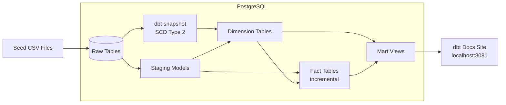
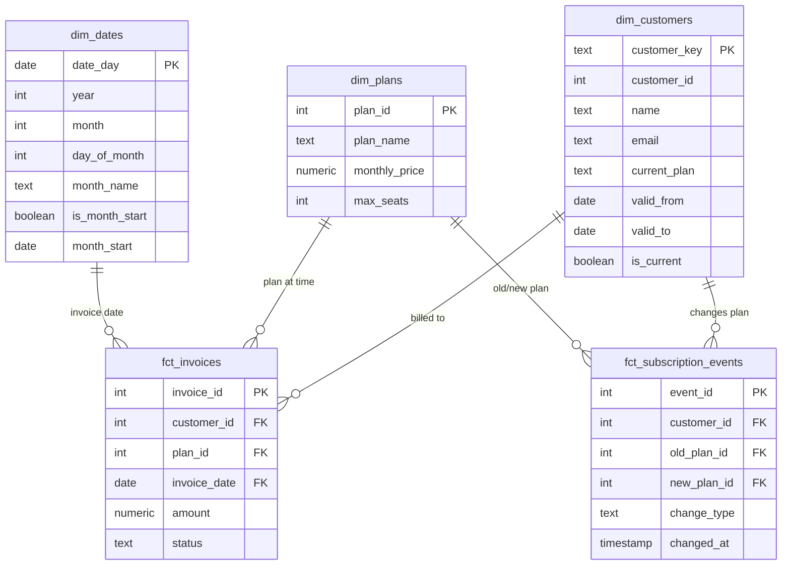

A dimensional modeling project that builds a star schema for SaaS subscription billing data. Customers change plans, pause and resume, upgrade and downgrade, all tracked as SCD Type 2 slowly changing dimensions using dbt snapshots, with incremental fact tables and custom generic tests. Includes a generated dbt docs site for exploring the DAG and column-level documentation.



## Why dimensional modeling

Most dbt projects you see in portfolios run `dbt init`, create a staging model and a single mart, and call it done. That's fine for learning the tool, but it doesn't demonstrate the skill that actually matters in analytics engineering interviews: modeling data that changes over time.

In a SaaS business, a customer's plan isn't static. They sign up on a free tier, upgrade to pro after a trial, downgrade when budgets tighten, maybe churn and come back later. If you only store the current plan, you can't answer "what plan were they on when they made that purchase?" or "how many customers downgraded last quarter?" -questions that every SaaS company cares about.

Dimensional modeling with SCD Type 2 solves this. Every time a customer's plan changes, the old record gets an `valid_to` timestamp and a new record opens. The fact table joins to the dimension using a date range, so you always get the plan that was active at the time of the event. This is the foundation of every serious analytics warehouse.

## How it works

The project models a subscription billing system for a fictional SaaS product with four plan tiers: free, starter, pro, and enterprise.

**Source data.** Seed CSV files provide the initial state: customers with signup dates and current plans, subscription change events (upgrades, downgrades, cancellations, reactivations), and invoices tied to billing periods. A Python script generates realistic subscription lifecycle patterns -customers don't jump from free to enterprise, they follow plausible upgrade paths with realistic timing.

**Snapshots.** dbt snapshots run against the `customers` table using `check` strategy on the `current_plan` column. Each time the plan value changes, dbt closes the old record (`dbt_valid_to` gets a timestamp) and opens a new one. This builds the SCD Type 2 history automatically -no manual `valid_from` / `valid_to` logic needed.

**Staging.** Standard dbt staging models: rename columns to consistent conventions, cast types, deduplicate where needed. One staging model per source table.

**Dimensions.** `dim_customers` joins the snapshot history to build a complete customer dimension with `valid_from` and `valid_to` date ranges. `dim_plans` is a static reference table with plan names, prices, and seat limits. `dim_dates` is a date spine generated by a dbt macro.

**Facts.** `fct_invoices` is an incremental model -on each run, it only processes invoices with an `invoice_date` after the last run's max. It joins to `dim_plans` using the invoice amount to pick up the plan tier for each billing event. `fct_subscription_events` tracks every plan change as a discrete event with the old plan, new plan, and change type.

**Marts.** `mart_monthly_recurring_revenue` calculates MRR by month and plan, accounting for upgrades, downgrades, and churn. `mart_cohort_retention` groups customers by signup month and tracks how many are still active in each subsequent month.

## Data model



## Custom generic tests

Beyond the standard `not_null` and `unique` tests, the project includes custom generic tests that enforce business logic:

- **valid_date_range** -ensures `valid_from` is always before `valid_to` on SCD Type 2 records, and that exactly one record per entity has a null `valid_to` (the current record)
- **no_overlapping_ranges** -checks that no customer has two active dimension records for the same date range, which would cause fan-out in fact table joins
- **referential_integrity_by_date** -verifies that every fact record can join to exactly one dimension record using the date range, catching both orphans and duplicates
- **accepted_transitions** -validates that plan changes follow allowed paths (e.g., free → starter is allowed, free → enterprise is not)

## Running it

```bash
docker compose up -d
```

This starts PostgreSQL and a dbt container. The dbt container runs seeds, snapshots, models, and tests on startup, then serves the dbt docs site.

Check everything ran cleanly:

```bash
docker compose logs dbt
```

You should see `dbt seed`, `dbt snapshot`, `dbt run`, and `dbt test` all complete with no errors.

Browse the dbt docs site at `localhost:8081` to explore the DAG, column descriptions, and test coverage.

Connect to the database to query the models directly:

```bash
docker compose exec postgres psql -U dbt -d analytics
```

```sql
-- MRR by plan over time
SELECT * FROM marts.mart_monthly_recurring_revenue ORDER BY month_start, plan_name;

-- Cohort retention
SELECT * FROM marts.mart_cohort_retention ORDER BY signup_cohort, months_since_signup;

-- SCD Type 2 history for a single customer
SELECT customer_id, current_plan, valid_from, valid_to, is_current
FROM dims.dim_customers
WHERE customer_id = 1
ORDER BY valid_from;
```

To simulate plan changes and see snapshots update:

```bash
docker compose exec dbt bash -c "python3 /app/scripts/simulate_changes.py && dbt snapshot && dbt run && dbt test"
```

This inserts new subscription events into the source, reruns snapshots (which close old records and open new ones), rebuilds the downstream models, and validates everything.

Shut it down:

```bash
docker compose down -v
```

## Design decisions

**SaaS billing as the domain.** Subscription data is the canonical use case for SCD Type 2 -plans change on known dates, you need historical accuracy for revenue reporting, and the business questions are intuitive. It's also a domain that every interviewer understands without needing context.

**dbt snapshots over manual SCD logic.** Writing your own `valid_from` / `valid_to` merge logic is error-prone and verbose. dbt snapshots handle this declaratively -you point them at a source table, tell them which columns to watch, and they maintain the history automatically. This is how production dbt projects handle SCDs.

**Check strategy over timestamp strategy.** dbt snapshots support two change-detection strategies: `timestamp` (compare an `updated_at` column) and `check` (compare the actual column values). Check strategy is more robust for this use case because it catches changes even if the source system doesn't reliably update its timestamp. The tradeoff is slightly more compute per snapshot run, which is irrelevant at this scale.

**Incremental fact tables.** `fct_invoices` uses dbt's `incremental` materialization with an `invoice_date` filter. On the first run, it processes everything. On subsequent runs, it only processes new rows. This demonstrates the pattern used in production to avoid full-table rebuilds on large datasets.

**Custom generic tests over one-off tests.** Generic tests are reusable across models -`valid_date_range` works on any SCD Type 2 table, not just `dim_customers`. This is how mature dbt projects scale their testing: build a library of generic tests that encode business rules, then apply them declaratively in YAML.
