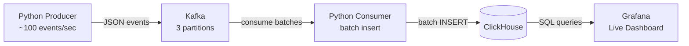

A portfolio project demonstrating real-time event streaming with sub-5-second end-to-end latency. A Python producer simulates ecommerce clickstream traffic, streams it through Kafka, writes it into ClickHouse, and surfaces live metrics on a Grafana dashboard.



## Why real-time streaming

In a traditional batch pipeline, events land in a data lake and get processed on a schedule: hourly, daily. Users see stale data and can't react to what's happening now.

This pipeline is different. Events flow continuously from producer to dashboard with no scheduled jobs. Kafka acts as a durable event stream rather than a queue that gets drained on a timer. The consumer processes data as it arrives, and Grafana refreshes every few seconds. The result is end-to-end latency under 5 seconds, from an event being generated to it showing up on a dashboard.

## How it works

A Python producer simulates 500 users browsing an ecommerce site, generating around 100 events per second. Each event is one of three types (`page_view`, `add_to_cart`, or `purchase`) and includes a user ID, product ID, price, and timestamp.

Events are published to a Kafka topic with 3 partitions, keyed by user ID so all activity for a given user lands on the same partition.

A Python consumer reads from Kafka using a consumer group and batch-inserts into ClickHouse every 1,000 rows or every 5 seconds, whichever comes first. ClickHouse handles the analytical queries: things like events per second, revenue in the last 5 minutes, and breakdowns by event type.

Grafana connects directly to ClickHouse and displays three panels:

- Events per second over time
- Event count by type
- Revenue from purchases in the last 5 minutes

## Design decisions

**Kafka over writing directly to the database.** Kafka decouples the producer from the consumer. If ClickHouse goes down or the consumer falls behind, events buffer in Kafka rather than getting lost. It also gives ordering guarantees per partition and lets you add more consumers later without touching the producer.

**ClickHouse over Postgres.** ClickHouse is a columnar OLAP engine built for analytical queries over large volumes of data. Aggregations like "events per second over the last hour" that would require careful indexing in Postgres run natively and fast in ClickHouse. For a write-heavy, read-analytical workload like clickstream data, it's a better fit.

**Micro-batching over single-row inserts.** Writing one row at a time to ClickHouse would create thousands of tiny inserts per second, which is inefficient for a columnar store. Buffering up to 1,000 rows (or 5 seconds) before flushing gives ClickHouse larger, more efficient blocks to write while keeping latency low enough for a real-time dashboard.

## Fault tolerance

The consumer commits its Kafka offset after each successful batch insert. If the consumer crashes and restarts, it reads the last committed offset and resumes from that point. No events are skipped.

This gives at-least-once delivery semantics. In a failure scenario where the consumer writes to ClickHouse but crashes before committing the offset, that batch would be re-processed on restart. For aggregated dashboard metrics like "events per second" this is acceptable. For use cases requiring exactly-once semantics, you'd pair this with idempotent writes or a transactional outbox pattern.

## Running it

```bash
docker compose up -d
```

This starts all five services: Kafka (KRaft mode, no ZooKeeper), ClickHouse, Grafana, the producer, and the consumer. Health checks ensure Kafka and ClickHouse are ready before the producer and consumer start.

Open `localhost:3000` for Grafana. Events should start appearing within seconds.

## Event schema

```json
{
  "event_id": "550e8400-e29b-41d4-a716-446655440000",
  "event_type": "purchase",
  "user_id": "user_0042",
  "product_id": "prod_123",
  "price": 29.99,
  "timestamp": "2024-01-15T14:30:00Z"
}
```

Deliberately kept simple: three event types, flat structure, no nested objects. The goal here is the infrastructure, not the data model.
